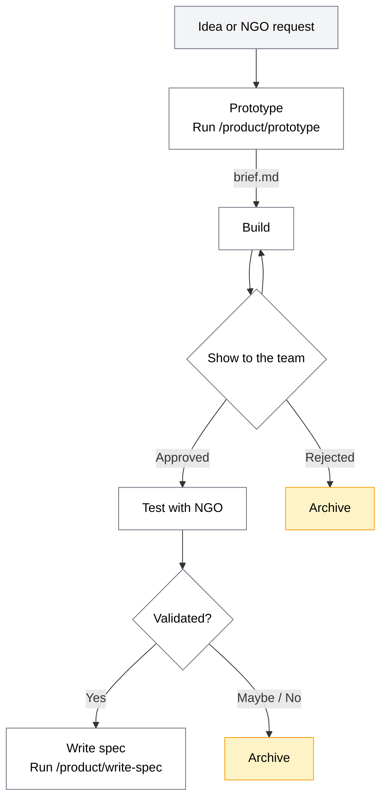
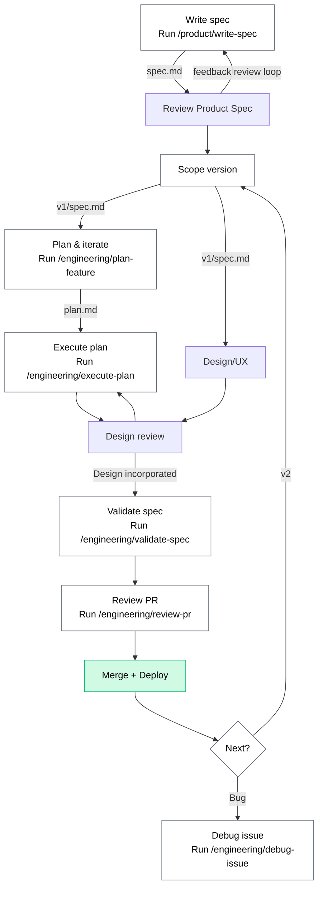

# dalgo-core

Central repo for AI-assisted development workflows, specs, plans, and Claude Code configuration for the Dalgo platform.

## Repo Structure

```
dalgo-core/
├── .claude/
│   ├── agents/              # Specialized AI agents (auto-invoked by context)
│   ├── commands/
│   │   ├── product/         # PM commands
│   │   └── engineering/     # Engineering commands
│   └── skills/              # Evaluation lenses / thinking frameworks
├── prototypes/
│   └── {feature-name}/
│       └── brief.md             # PM's prototype brief (spike)
├── features/
│   └── {feature-name}/
│       ├── spec.md              # PM's original spec (full vision)
│       ├── v1/
│       │   ├── spec.md          # Engineering's scoped iteration
│       │   ├── research.md      # Codebase & external research
│       │   ├── plan.md          # Implementation plan (HLD, LLD, security, milestones)
│       │   └── tasks.md         # Execution progress checkpoint
│       └── v2/
│           └── ...              # Next iteration
├── DDP_backend -> ../DDP_backend   (symlink, gitignored)
└── webapp_v2 -> ../webapp_v2       (symlink, gitignored)
```

## Three Types of Tools

| Type | Location | Purpose | How to Use |
|------|----------|---------|------------|
| **Commands** | `.claude/commands/{product,engineering}/` | Step-by-step workflows with inputs and outputs | `/product/command` or `/engineering/command` |
| **Agents** | `.claude/agents/` | Specialized personas invoked by context | Claude picks the right agent automatically |
| **Skills** | `.claude/skills/` | Evaluation lenses — shift how Claude looks at a problem | Invoke by name (e.g. `/design-review`) |

---

## Feature Lifecycle

### Spike Track (PM or Anyone)

Quick validation with NGO partners before committing engineering time. PM owns this end-to-end.

| | |
|---|---|
| **Run** | `/product/prototype "feature idea"` or `/product/prototype path/to/notes.md` |
| **Saves to** | `prototypes/{feature-name}/brief.md` |
| **Then** | Optionally builds prototype code in a separate branch |
| **Review** | Show to the team before showing to users |
| **After testing** | Validated → `/product/write-spec` to promote. Didn't work → archive & move on. |




### Engineering Track

Production-quality implementation for confirmed features. Engineering owns this. All artifacts in `features/`.



### When to use which

| | Spike | Engineering |
|---|---|---|
| **Confidence** | "I think this might work" | "We know we need this" |
| **Goal** | Validate with an NGO user | Ship to production |
| **Time** | Hours | Days |
| **Workspace** | `prototypes/` | `features/` |
| **Command** | `/product/prototype` | `/product/write-spec` → `/engineering/*` |

---

## Commands Reference

### Product Commands

#### `/product/prototype`
Quick spike — validate an idea with NGO partners before committing to a full spec.

```
/product/prototype "let users bookmark their favorite dashboard charts"
```
**Output:** `prototypes/{feature-name}/brief.md` (1-page brief with problem, scope, quick plan)
**Optionally:** builds the prototype code with `# PROTOTYPE` markers
**Next step:** Test with NGO → if validated, `/product/write-spec "{feature name}"`

#### `/product/write-spec`
Two modes in one command:

**Mode A — New spec** (from an idea):
```
/product/write-spec "scheduled report emails for dashboard owners"
```
**Output:** `features/{feature-name}/spec.md` (full vision)

**Mode B — Scope a version** (from an existing spec):
```
/product/write-spec features/scheduled-reports
```
**Output:** `features/{feature-name}/v1/spec.md` (or v2, v3, etc.)
**Next step:** `/engineering/plan-feature features/{feature-name}/v1/spec.md`

### Engineering Commands

#### `/engineering/plan-feature`
Generate an implementation plan with HLD, LLD, security review, and milestones.

```
/engineering/plan-feature features/scheduled-reports/v1/spec.md
```
**Output:** `features/{feature-name}/v1/plan.md` + `research.md`

The plan is a **draft** — engineers iterate on it through conversation. Claude updates `plan.md` in place.

#### `/engineering/execute-plan`
Implement the feature following the plan, with checkpointing.

```
/engineering/execute-plan features/scheduled-reports/v1/plan.md
```
**Creates:** `features/{feature-name}/v1/tasks.md` for progress tracking
**Next step:** `/engineering/validate-spec`

#### `/engineering/debug-issue`
Diagnose a bug from a Sentry URL, error message, or behavior description.

```
/engineering/debug-issue https://sentry.io/issues/DALGO-123/
/engineering/debug-issue "500 error on /api/v1/organizations/"
```

#### `/engineering/review-pr`
Structured code review — checks service-specific conventions, security, testing, breaking changes.

```
/engineering/review-pr 142
/engineering/review-pr https://github.com/DalgoT4D/DDP_backend/pull/142
```
Does NOT auto-post to GitHub — outputs the review for you to use.

#### `/engineering/validate-spec`
Validates the implementation against the spec. Checks that all spec requirements are met, runs lint, tests, and migration checks. Read-only.

```
/engineering/validate-spec
```

#### `/product/generate-docs`
Generate or update a Docusaurus documentation page for a Dalgo feature.

**Mode A — Feature name:**
```
/product/generate-docs "orchestrate"
/product/generate-docs "data quality"
```

**Mode B — PR or commit range:**
```
/product/generate-docs "#142"
/product/generate-docs "abc123..def456"
```

**Output:** Markdown page in `dalgo_docs/docs/` at the correct location per the IA, screenshots in `dalgo_docs/static/img/{feature}/`, and updated `dalgo_docs/sidebars.js` if it's a new page.

The skill reads `.claude/skills/docs-generation/SKILL.md` for the feature-to-route mapping and sidebar structure, and `style-guide.md` for writing conventions.

---

### Screenshot Script

Captures all documentation screenshots from the staging environment in one run. Output goes directly into `dalgo_docs/static/img/`.

**Setup — create `dalgo_docs/.env`:**
```
E2E_ADMIN_EMAIL=your@email.com
E2E_ADMIN_PASSWORD=yourpassword
E2E_BASE_URL=https://staging-app.dalgo.org
```

**Run:**
```bash
cd dalgo-core

# Using .env file
export $(cat ../dalgo_docs/.env | xargs) && python3 scripts/screenshot_docs_all.py

# Or inline
E2E_ADMIN_EMAIL=your@email.com \
E2E_ADMIN_PASSWORD=yourpassword \
E2E_BASE_URL=https://staging-app.dalgo.org \
python3 scripts/screenshot_docs_all.py
```

**What it captures:** pipeline overview, pipeline logs, user management, usage dashboard, ingest (connections, sources, warehouse form), dashboards, orchestrate, reports (list, create, detail, share, comment).

**Requirements:**
```bash
pip install playwright python-dotenv
playwright install chromium
```

**Staging environment:**


> The staging environment is at `https://staging-app.dalgo.org`. Ask the team for access credentials if you don't have them.

---

## Agents

Agents are specialized personas that Claude invokes automatically when the context matches. Agents use skills as reference material for their decisions.

| Agent | What It Does | Skills Used |
|-------|-------------|-------------|
| **debugger** | Diagnoses bugs across the full stack — Django backend, Next.js frontend, or cross-cutting. | `backend-architecture`, `frontend-architecture` |
| **senior-product-manager** | Product strategy and feature specs. Prioritization, roadmap, build-vs-buy, spec writing. | None — uses its own evaluation framework |
| **ux-design-expert** | UI/UX design using Dalgo's design system (Shadcn, teal brand, Tailwind). | `design-review` (patterns.md for design system reference) |
| **ngo-data-platform-consultant** | Evaluates features as "Priya" — a non-technical NGO program manager. | None — uses its own NGO persona framework |

---

## Skills

| Skill | What It Does |
|-------|-------------|
| **design-review** | Combined UX expert + NGO user evaluation of UI components or screenshots. |
| **tal-lens** | Tal Raviv's technology philosophy — demystify, build first, anti-hype, clarity over cleverness. |
| **docs-generation** | Feature-to-route mapping, sidebar structure, file locations, and writing conventions for Dalgo docs. Loaded automatically by `/product/generate-docs`. |

---

## Common Workflows

### Spike (idea to validation)
```
/product/prototype "feature idea"
# test with NGO partner...
# if validated:
/product/write-spec "feature idea"
```

### New Feature (idea to merge)
```
/product/write-spec "feature idea"
/product/write-spec features/{name}
/engineering/plan-feature features/{name}/v1/spec.md
# iterate on plan...
/engineering/execute-plan features/{name}/v1/plan.md
/engineering/validate-spec
/engineering/review-pr <pr-number>
```

### Bug Fix
```
/engineering/debug-issue "error description or Sentry URL"
# implement the fix
/engineering/validate-spec
```

### Design Feedback
```
/design-review
```

### Writing or Updating Docs

```bash
# Generate a doc page for a feature
/product/generate-docs "reports"

# After a PR lands, update affected docs
/product/generate-docs "#142"

# Capture all screenshots from staging in one run
export $(cat ../dalgo_docs/.env | xargs) && python3 scripts/screenshot_docs_all.py

# Preview the docs site locally
cd ../dalgo_docs && npm start
```

### Next Iteration
```
/product/write-spec features/{name}
# creates v2/spec.md from remaining items in original spec
/engineering/plan-feature features/{name}/v2/spec.md
```

---

## What's Intentionally NOT Included

| Idea | Why Not |
|------|---------|
| `/write-tests` | Test writing is part of `/engineering/execute-plan`. |
| `/deploy` | Deployment depends on CI/CD that varies per environment. |
| `/estimate` | Effort estimation needs team velocity context Claude can't provide. |
| Repo-level agents | Workspace-level agents read all repos via symlinks. |
| Research agent | Research is a step within `/engineering/plan-feature`, saved as `research.md`. |
