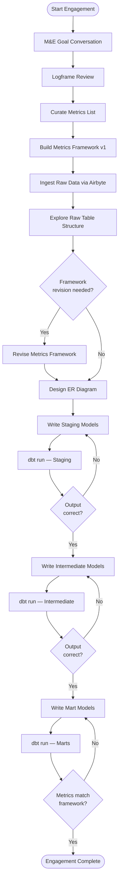

# Dalgo Consulting Process — dbt Model Development

This document captures the end-to-end consulting workflow for building dbt SQL models that transform raw NGO program data into insights and metrics. It is the reference for designing agentic skills around this workflow.

---

## Overview

The consulting engagement bridges two worlds: the client's M&E (Monitoring & Evaluation) logic, and the technical dbt data model that implements it. The workflow moves through four phases — **Discovery → Framework → Data Exploration → Model Development**.

The framework and data exploration phases have a feedback loop: the framework captures business logic first, but once raw data is explored, the calculation logic may need to be revised to reflect what is actually available in the data.

## Flowchart



---

## Phase 1: Discovery

**Goal:** Understand what the client is trying to measure and why.

### Steps

1. **M&E Goal Conversation**
   - Meet with client to understand program objectives and M&E goals for each program/intervention.
   - Capture: program names, reporting cadence, audience (internal vs. donor), key questions the data must answer.

2. **Logframe Review**
   - Review the client's logframe (logical framework) document.
   - Extract and record:
     - **Inputs** — resources, activities, data sources
     - **Outputs** — direct deliverables
     - **Outcomes** — medium-term changes
     - **Impact** — long-term goals
   - Note which levels need quantitative tracking vs. qualitative.

### Artifacts
- `discovery/me_goals.md` — M&E goals per program
- `discovery/logframe_notes.md` — annotated logframe with inputs/outputs extracted

---

## Phase 2: Framework

**Goal:** Translate M&E goals into a structured, implementation-ready metrics framework.

### Steps

3. **Curate Metrics List**
   - In alignment with the logframe, enumerate all metrics that need to be tracked.
   - Each metric maps to one or more logframe outputs/outcomes.

4. **Build the Metrics Framework**
   - For each metric, document:
     - **Metric name** — human-readable
     - **Logframe alignment** — which output/outcome it measures
     - **Data source(s)** — which raw table(s) feed it
     - **Definition** — plain English definition
     - **Calculation logic** — formula or aggregation method
     - **Filters / conditions** — time ranges, cohort conditions, exclusions
     - **Granularity** — per-beneficiary, per-location, per-period
     - **Owner** — who is responsible for the metric

### Artifacts
- `framework/metrics_framework.md` (or `.csv`) — the master metrics-to-sources map

---

## Phase 3: Data Exploration

**Goal:** Understand the actual shape of the raw data before designing models.

### Steps

5. **Ingest Raw Data**
   - Data sources (KoboToolbox, Google Sheets, ODK, CRMs, etc.) are ingested via Airbyte into raw tables in the warehouse.
   - Confirm all sources identified in the framework are available.

6. **Explore Raw Table Structure**
   - For each raw table, query to understand:
     - Column names, data types
     - Null rates and cardinality for key columns
     - Sample rows
     - Join keys (IDs that link tables together)
     - Date/time fields and their formats
     - Anomalies, duplicates, encoding issues

7. **Revise Framework (if needed)**
   - After exploring raw tables, revisit the metrics framework.
   - If data structure, quality, or available fields differ from assumptions, update:
     - Calculation logic (e.g., a metric assumed a direct field but requires a derived one)
     - Data source mapping (e.g., a table is missing a join key; an alternate path is needed)
     - Filters/conditions (e.g., a status field has unexpected values)
   - The framework is the source of truth — models must trace back to its latest version.

8. **Design ER Diagrams**
   - Start from a standard NGO entity pattern (beneficiary → program enrollment → activity → outcome) and adapt to the specific program structure.
   - ER diagram shows:
     - Entities and their grain (one row = one what?)
     - Relationships and cardinalities
     - Which raw tables map to which entities
     - Join paths needed to compute each metric

### Artifacts
- `data_exploration/table_profiles.md` — per-table structure notes
- `data_exploration/er_diagram.md` (or `.png`) — ER diagram
- `framework/metrics_framework.md` — updated with any revisions from data exploration

---

## Phase 4: Model Development (dbt Medallion Architecture)

**Goal:** Build, run, verify, and iterate dbt models layer by layer.

The models follow a **staging → intermediate → mart** medallion pattern. Each layer is written and verified before proceeding to the next.

### Layer 1: Staging (`stg_`)

- One model per raw source table.
- Responsibilities: rename columns to consistent conventions, cast data types, deduplicate, handle nulls, no business logic.
- **Run & verify** before proceeding: check row counts match source, no unexpected nulls in key columns, data types correct.

### Layer 2: Intermediate (`int_`)

- Join and reshape staging models into business entities.
- Responsibilities: joins across staging models, cohort construction, derived fields (e.g., age from DOB, duration from start/end), light aggregations.
- **Run & verify** before proceeding: validate join cardinalities, check for fan-out or row loss, spot-check derived fields against raw data.

### Layer 3: Mart (`fct_` / `dim_`)

- Final models exposing metrics and dimensions for reporting.
- Responsibilities: metric calculations per the framework (aggregations, filters, period logic), dimension tables (beneficiaries, locations, programs).
- **Run & verify** after each model: compare computed metric values against manually calculated spot checks, validate against framework definitions.

### Development Loop (per layer)

Run manually via dbt CLI. The engineer writes models, runs them, inspects output in the warehouse, corrects logic, and reruns until the layer is confirmed correct before moving on.

```
write model → dbt run → inspect output in warehouse → correct logic → dbt run → confirm → proceed to next layer
```

### Artifacts
- `models/staging/stg_*.sql`
- `models/intermediate/int_*.sql`
- `models/marts/fct_*.sql`, `dim_*.sql`
- `models/schema.yml` — column descriptions and dbt tests (not_null, unique, accepted_values, relationships)

---

## Full Artifact Map

```
workdocs/consulting/{engagement}/
├── discovery/
│   ├── me_goals.md
│   └── logframe_notes.md
├── framework/
│   └── metrics_framework.md
├── data_exploration/
│   ├── table_profiles.md
│   └── er_diagram.md
└── models/                        ← or inside the dbt project repo
    ├── staging/
    ├── intermediate/
    └── marts/
```

---

## Key Principles

- **Framework-first:** No model is written without a corresponding metric definition in the framework. This prevents scope creep and ensures every SQL line traces back to a business requirement.
- **Framework is living until data exploration is done:** The framework captures business intent upfront, but calculation logic may be revised after raw tables are explored. The post-exploration version is the binding reference for model development.
- **ER patterns are reused, not reinvented:** Start from the standard NGO entity pattern and adapt. Don't design from scratch for every engagement.
- **Layer-by-layer verification:** Models are run via dbt CLI and validated at each layer boundary before the next layer is written. Currently a manual process; the engineer inspects output directly in the warehouse.
- **Traceability:** Every metric in the mart layer should be traceable back to a raw column via the staging and intermediate layers.
- **NGO context:** Data quality in NGO sources is often poor (paper-to-digital, inconsistent enumerators, mid-program schema changes). The staging layer must be defensive; document assumptions explicitly.
- **Current audience:** Dalgo data engineers. Future goal is to make parts of this accessible to non-technical data coordinators at partner NGOs.
