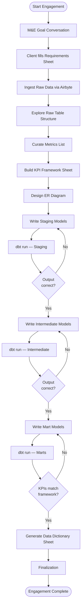
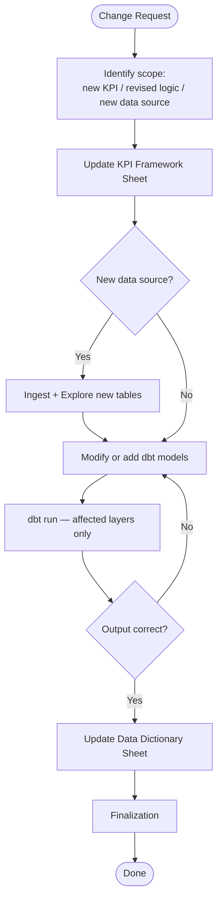

# Dalgo Consulting Process — dbt Model Development

This document captures the end-to-end consulting workflow for building dbt SQL models that transform raw NGO program data into insights and metrics. It is the reference for designing agentic skills around this workflow.

---

## Overview

The consulting engagement bridges two worlds: the client's M&E (Monitoring & Evaluation) logic, and the technical dbt data model that implements it. The workflow moves through four phases — **Discovery → Data Exploration → Framework → Model Development**.

The Requirements Sheet captures business intent first. Raw data is then ingested and explored. Only after both are available does the consultant or LLM turn that input into the KPI Framework Sheet.

There are two tracks:
- **New engagement** — full four-phase process for a new client or program
- **Modification** — lightweight track for existing clients updating or adding metrics

---

## Flowchart — New Engagement



## Flowchart — Modification Track



---

## Phase 1: Discovery

**Goal:** Understand what the client is trying to measure and why, with minimal but structured client input upfront.

### Steps

1. **M&E Goal Conversation**
   - Meet with client to understand program objectives and M&E goals per program/intervention.
   - Capture: program names, reporting cadence, audience (internal vs. donor), key questions the data must answer.
   - Output: consultant fills `me_goals.md` — this stays as a lightweight MD summary.

2. **Client Fills Requirements Sheet**
   - Share the **Requirements Sheet** (Google Sheet template) with the client.
   - The client fills in their existing logical framework / logframe — what they want to measure, with what formulas, from what data sources, and with what breakdown dimensions.
   - This is the primary client input artifact for the entire engagement. Keep the form simple: one row per metric they want, with columns for calculation intent, data source, and reporting audience.
   - The consultant reviews this sheet and adds annotations in a dedicated "Consultant Notes" column.
   - This sheet is the input that later feeds KPI Framework creation after data exploration. It does not need to be re-created — it is updated in-place as the engagement progresses.

### Artifacts

| Artifact | Format | Owner | Purpose |
|---|---|---|---|
| `me_goals.md` | Markdown | Consultant | Summary of goals conversation |
| Requirements Sheet | Google Sheet | Client (consultant annotates) | Client's intended metrics, data sources, calculation intent — primary requirements input |

---

## Phase 2: Data Exploration

**Goal:** Understand the actual shape of the raw data before the consultant or LLM turns the Requirements Sheet into the KPI Framework.

### Steps

3. **Ingest Raw Data**
   - Data sources (KoboToolbox, Google Sheets, ODK, CRMs, etc.) are ingested via Airbyte into raw tables in the warehouse.
   - Confirm the source systems referenced in the Requirements Sheet are actually available.

4. **Explore Raw Table Structure**
   - For each raw table, query to understand:
     - Column names and data types
     - Null rates and cardinality for key columns
     - Sample rows
     - Join keys (IDs linking tables)
     - Date/time fields and formats
     - Anomalies, duplicates, encoding issues

### Artifacts

| Artifact | Format | Owner | Purpose |
|---|---|---|---|
| `table_profiles.md` | Markdown | Consultant | Per-table structure notes from exploration |

---

## Phase 3: Framework

**Goal:** Translate the Requirements Sheet into a structured, implementation-ready KPI Framework using what was learned during data exploration.

**KPI Framework vs. Requirements Sheet — the distinction:**

The Requirements Sheet is written by the client in program/M&E language. It captures intent. The client does not need to know anything about databases to fill it.

The KPI Framework Sheet is built by the consultant in data/technical language. It captures implementation. It is written only after the raw table structure has been explored.

The same metric looks like this in each:

| | Requirements Sheet (client fills) | KPI Framework Sheet (consultant builds) |
|---|---|---|
| What it says | "% of female beneficiaries who completed the full training cycle — completions divided by enrolled, by gender, monthly, for donor report" | `COUNT(DISTINCT beneficiary_id WHERE gender='F' AND sessions_attended >= required_sessions) / COUNT(DISTINCT beneficiary_id WHERE gender='F')` — from `kobo_training_responses` joined to `enrollment_master` on `beneficiary_id`, filter `program_id = 'prog_x'`, grain: monthly per program, mart: `fct_training_completion` |
| Who can fill it | The M&E manager | The consultant or LLM, after data exploration |
| When it locks | After requirements review | After framework review, using explored raw data as input |

They are separate sheets because they have different audiences (client vs. data team) and different lifecycles (Requirements captures intent early; KPI Framework is the technical interpretation grounded in the real data shape).

### Steps

5. **Curate Metrics List**
   - Read the Requirements Sheet and enumerate all KPIs that need to be tracked.
   - Use the explored raw tables to deduplicate, consolidate overlapping metrics, and flag anything ambiguous for clarification.
   - This list becomes the rows of the KPI Framework Sheet.

6. **Build the KPI Framework Sheet**
   - One row per KPI. Columns:
     - **KPI name** — human-readable label
     - **Requirements alignment** — which row in the Requirements Sheet this maps to
     - **Definition** — plain English definition of what is being measured
     - **Calculation logic** — formula or aggregation (e.g., `COUNT(DISTINCT beneficiary_id) WHERE activity_type = 'training'`)
     - **Data source(s)** — which raw table(s) feed it, based on data exploration
     - **Filters / conditions** — time ranges, cohort conditions, exclusions
     - **Granularity** — per-beneficiary / per-location / per-period
     - **Mart model** — which `fct_` or `dim_` model will expose this metric
     - **Status** — draft / confirmed / revised
   - The consultant or LLM should build this sheet from both inputs together: the Requirements Sheet and the explored raw data.

7. **Design ER Diagram**
   - Use the KPI Framework Sheet to decide which entities, joins, and dbt model boundaries are needed.
   - Document: entities and grain, relationships and cardinalities, which raw tables map to which entities, and the join paths needed for each KPI.

### Artifacts

| Artifact | Format | Owner | Purpose |
|---|---|---|---|
| KPI Framework Sheet | Google Sheet | Consultant | Technical spec for every metric: definition, calculation logic, sources, granularity. Built after data exploration and used as the contract for model development. |
| `er_diagram.md` / `.png` | Markdown / Image | Consultant | Entity-relationship diagram derived from the KPI Framework and used to shape dbt models. |

---

## Phase 4: Model Development (dbt Medallion Architecture)

**Goal:** Build, run, verify, and iterate dbt models layer by layer.

The models follow a **staging → intermediate → mart** medallion pattern. Each layer is written and verified before proceeding to the next.

### Layer 1: Staging (`stg_`)

- One model per raw source table.
- Responsibilities: rename columns, cast data types, deduplicate, handle nulls. No business logic.
- For nested/JSON data: decide which fields to extract, how to handle arrays, consistent naming conventions.
- **Run & verify:** row counts match source, no unexpected nulls in key columns, data types correct.

### Layer 2: Intermediate (`int_`)

- Join and reshape staging models into business entities.
- Responsibilities: joins across staging models, cohort construction, derived fields (age from DOB, duration from start/end), light aggregations.
- **Run & verify:** validate join cardinalities, check for fan-out or row loss, spot-check derived fields.

### Layer 3: Mart (`fct_` / `dim_`)

- Final models exposing metrics and dimensions for reporting.
- Responsibilities: metric calculations per KPI Framework (aggregations, filters, period logic), dimension tables.
- **Run & verify:** compare computed metric values against manually calculated spot checks, validate against KPI Framework definitions.

### Development Loop (per layer)

```
write model → dbt run → inspect output in warehouse → correct logic → dbt run → confirm → proceed
```

### Data Dictionary (Final Deliverable)

At the end of model development, generate a **Data Dictionary Sheet** (Google Sheet) for the client. This is a structured reference of every table and column in the final dbt models.

Columns:
- **Schema** — `staging` / `intermediate` / `marts`
- **Table name** — full dbt model name
- **Column name**
- **Data type**
- **Description** — plain English definition (pulled from `schema.yml` descriptions)
- **Example value** (optional)
- **Source** — raw table/column it originates from (for staging models)
- **KPI** — which KPI this column feeds (for mart models)

This sheet, alongside the dbt lineage and auto-generated dbt docs, is the handoff artifact to the client's data team.

### Finalization

This is the single final step after the Data Dictionary is generated, for both new engagements and modification work.

1. **Lint and fix all models**
   - Run SQLFluff across the full dbt model set, not just the files changed in the current task.
   - Fix lint violations before moving forward.

2. **Run dbt-osmosis refactor and generate**
   - Use dbt-osmosis to refactor and generate documentation across the project.
   - Let it use AI to create any missing documentation and propagate it into the dbt project.
   - This includes updating `schema.yml` documentation as part of the final documentation pass.
   - Treat this as the final documentation pass after model logic and `schema.yml` are stable.

3. **Create a new branch and open a GitHub PR to `main`**
   - All consulting code changes should be delivered on a dedicated git branch, not pushed directly to a shared branch.
   - Push that branch to GitHub and open a pull request against `main`.
   - The PR is the review and merge gate for both new-engagement work and modification work.

### Artifacts

| Artifact | Format | Owner | Purpose |
|---|---|---|---|
| `models/staging/stg_*.sql` | SQL | Engineer | Staging models |
| `models/intermediate/int_*.sql` | SQL | Engineer | Intermediate models |
| `models/marts/fct_*.sql`, `dim_*.sql` | SQL | Engineer | Mart models |
| `models/schema.yml` | YAML | Engineer | Column descriptions, dbt tests, and dbt-osmosis-synced model documentation |
| dbt docs site | Generated | Engineer | Auto-generated lineage and documentation |
| Data Dictionary Sheet | Google Sheet | Engineer → Client | All tables and columns with definitions — client-facing handoff artifact |

---

## Full Artifact Map

```
workdocs/consulting/{engagement}/
├── discovery/
│   └── me_goals.md
├── data_exploration/
│   ├── table_profiles.md
│   └── er_diagram.md
└── models/                        ← or inside the dbt project repo
    ├── staging/
    ├── intermediate/
    └── marts/

Google Sheets (linked from workdocs, not stored as files):
├── Requirements Sheet             ← client-filled, consultant-annotated
├── KPI Framework Sheet            ← consultant-built technical spec
└── Data Dictionary Sheet          ← generated at engagement close
```

---

## Modification Track (Existing Clients)

For clients already live on Dalgo who want to add or change metrics — no full re-engagement needed.

**Entry point:** A change request describing what needs to change (new KPI, revised formula, new data source, new breakdown dimension).

**Steps:**
1. Open the existing KPI Framework Sheet for the client.
2. Add new rows or mark existing rows for revision. Update calculation logic, filters, or source columns as needed.
3. If the change involves a new data source: ingest via Airbyte, explore the new tables, update table_profiles.md, update the ER diagram if relationships change.
4. Identify the affected dbt model layers. Only rewrite or modify the models that are impacted — do not rebuild the full model set.
5. Run dbt for affected models only. Verify output.
6. Update the Data Dictionary Sheet to reflect added/changed tables and columns.
7. Run the same **Finalization** step used in the new-engagement flow.

**Artifacts updated (not recreated):**
- KPI Framework Sheet — revised rows marked with date and change reason
- Data Dictionary Sheet — updated columns/tables
- Affected SQL models and schema.yml only

---

## Key Principles

- **Requirements Sheet drives scope:** The client fills this once at the start and it is the input to the KPI Framework. Avoid scope creep by requiring changes to go through an explicit update to the Framework Sheet.
- **KPI Framework is the technical contract:** Every dbt model traces back to a row in the KPI Framework Sheet. No model is written without a corresponding KPI definition.
- **Data exploration comes before KPI Framework authoring:** Business intent is captured upfront, raw tables are explored next, and only then is the KPI Framework written.
- **Data Dictionary is a client deliverable:** Not just internal documentation — it is the handoff artifact that lets the client's team understand and maintain their data independently.
- **Modification track is the default for live clients:** Once a client is set up, almost all work flows through the modification track. Avoid re-running the full process unless the program structure has fundamentally changed.
- **Layer-by-layer verification:** Models are run and validated at each layer boundary before the next layer is written.
- **Finalization is mandatory:** After the Data Dictionary step, always run the single Finalization step before delivery.
- **Documentation is part of delivery, not cleanup:** Use dbt-osmosis refactor and generate to fill missing documentation and propagate it through the dbt project.
- **Lint the whole model set:** SQLFluff is run across all models for both new builds and modifications, and lint issues are fixed before the PR is opened.
- **Delivery is PR-based:** Consulting changes ship through a dedicated branch and GitHub pull request to `main`, never by direct push to a shared branch.
- **NGO data quality is often poor:** Paper-to-digital conversion, inconsistent enumerators, mid-program schema changes. The staging layer must be defensive; document assumptions explicitly in table_profiles.md and schema.yml.
